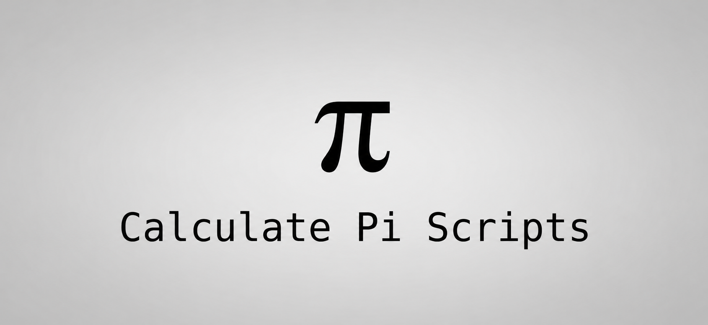

# Calculate Pi Scripts
Are you a **junior programmer** (or **senior**), a **data scientist**, or **something else**, that want to **test code** that isn't "Hello, World!", but want to **test** with **math** and **calculate** the famous constant **π (Pi)**? 
So, you are in the right place! Welcome to the **Calculate Pi Scripts!**
The **Calculate Pi Scripts** is a **GitHub repository** that holds many **code files**, **executables** (that includes **bytecode** also), that calculate the **Pi**. The majority of the languages present here, are good at calculating, because I've searched much and selected the **best languages** with the **best performance** in this matter (and others that aren't used very much for math, but they're **known**, and **I like it**, but if you think it should be **deleted** because it's ***nonsense*** using it, **I'll delete it**), and also the **best methods** to **calculate** (like **Chudnovsky**, **Monte Carlo**, **Leibniz**, **Nilakantha**, **Machin's Formula**, **Big Decimal**, **BBP**, or simply **Math.PI**).

## How to download?
To install **everything** (only working on **Bash**) with an **all-in-one solution**, **copy** this **command** that downloads and executes an **install.sh** and you can check it in this repo:
```
bash <(curl -fsSL https://raw.githubusercontent.com/Amonnium/Calculate-Pi-Scripts/refs/heads/readme.md/install.sh)
```
To install separated files, go to the **Releases**, and download the files you want, based on your OS, because the **.EXEs** only work on **Windows™**, and the ones **without .exe extension** on **Unix-like** systems. **Please follow the instructions showed in the Releases and on Dependencies directory's README, for not get doubts and problems with dependencies and such things.**
Also, if you want to **install** the dependencies on a **intelligent way** and you use a **Debian-based system**, you can use the **install.sh** script (included in the main installer, by the way) present in **Dependencies directory** using this **command**:
```
bash <(curl -fsSL https://raw.githubusercontent.com/Amonnium/Calculate-Pi-Scripts/refs/heads/readme.md/Dependencies/install.sh)
```
If you only want a **list of commands** to **download** them **independently** (also, only on a **Debian-based system**), there are on the **README** at the **same directory**.

## How to build?
To build the repo, the best way is cloning with Git, and removing files that will not work on your system.

- For Unix-like systems (Linux):
```
git clone https://github.com/Amonnium/Calculate-Pi-Scripts.git
cd Calculate-Pi-Scripts
rm -r Pi_in_PowerShell
rm Pi.bat
rm Pi_in_C++_Folder/Pi_in_C++.exe Pi_in_C_Folder/Pi_in_C.exe Pi_in_Go_Folder/Pi_in_Go.exe Pi_in_Go_Folder/Math_Pi_in_Go.exe Pi_in_Rust_Folder/Pi_in_Rust.exe Pi_in_Rust_Folder/Math_Pi_in_Rust.exe
```

- For Windows:
```
git clone https://github.com/Amonnium/Calculate-Pi-Scripts.git
cd Calculate-Pi-Scripts
del install.sh
del Dependencies/install.sh
del Pi.sh
del Pi_in_C++_Folder/Pi_in_C++. Pi_in_C_Folder/Pi_in_C Pi_in_Go_Folder/Pi_in_Go Pi_in_Go_Folder/Math_Pi_in_Go Pi_in_Rust_Folder/Pi_in_Rust Pi_in_Rust_Folder/Math_Pi_in_Rust
```

## How to contribute?
You can **contribute** to the **repository**, **issuing ideas**, like a **new language** and it's **best methods** and **the code**, or for **change a file**, or **delete it**.
Also, you can **contribute** with **redistributing** and **forking** the **repository**.
In the future, you'll have the possibility to **donate** and help with this **hobby projects**, because this is made with **dedication**.
If you don't want to spend money, get to know that when you download, you are also **contributing**.

## Copyright and Ownership of the files
Many of you that analyzed the **code** and searched like me, are thinking "This guy is only **stealing** the **code** from **other programmers!**", and I want to say that **I CONDEMN STEALING**, and when I can, **I give the credits** to the **original creators** and give the **guarantee** of **taking down the specific files** from here, if any of the developers that created the code, contacts me. Not all the project is taken down, but the specific files that are **"copyrighted"**.
If you still don't know what's this, it's a **book library-like repository** that shows you **scripts** to calculate the **Pi**, and gives you the **freedom** to **download** and **test** it, **suggest changes** and **redistribute** with your changes.
**You can do** the things **you want**, but under the terms of the **MIT License**.

### Actual Copyright ©
**Windows** is a trademark from **Microsoft Corporation**. 

----------------------------------------------
Thank you for visiting this repository.

**The creator, Amonnium.**