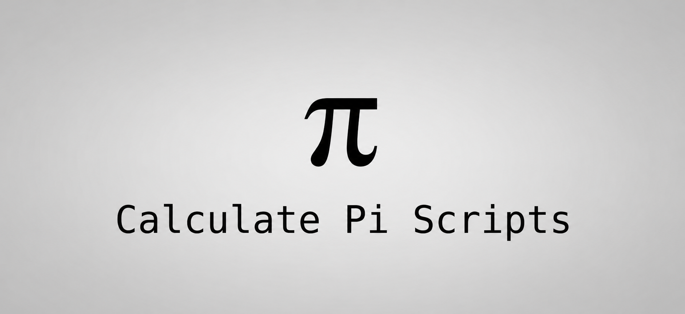

# Calculate Pi Scripts



Calculate Pi Scripts is a multi-language collection of programs that calculate or approximate pi.

It is made for beginners and experienced developers who want to learn, compare different approaches, experiment with code, or simply have fun calculating pi.

The repository contains source code, available precompiled binaries and bytecode, and beginner-friendly documentation.

## Beginner guides

- [Getting started](docs/getting-started.md)
- [Languages and commands](docs/languages.md)
- [Algorithms](docs/algorithms.md)
- [Toolchains](docs/toolchains.md)
- [Troubleshooting and FAQ](docs/troubleshooting.md)

For a broader overview of the documentation, see the [documentation index](docs/README.md).

---

## The collection

The complete Calculate Pi Scripts collection is the collection of implementations throughout this repository.

It includes implementations in:

- Python
- C
- C++
- Rust
- Go
- Java
- Julia
- JavaScript
- Kotlin
- Nim
- PowerShell
- C#
- Lua
- Perl
- Raku
- Ruby
- Zig
- Windows Batch

The implementations use different languages, techniques, algorithms and, where appropriate, standard-library constants.

The purpose of the collection is not to provide only one "best" way to calculate pi. Instead, it provides different implementations that can be read, compared, executed and experimented with.

If you want to learn how one of the implementations works or how to run it manually, start with the [language guide](docs/languages.md).

---

## The CLI

Calculate Pi Scripts also provides an optional terminal user interface (TUI) for users who want a more guided way to run selected implementations.

The CLI currently supports:

- Python
- C
- C++
- Rust
- Go
- Java
- Julia

The CLI intentionally does not cover every language in the repository.

The complete collection remains available independently through the source code, scripts, binaries and documentation.

The CLI provides a guided interface for selecting an implementation, obtaining the required artifact, checking required runtimes and running the selected program.

### Installing the CLI

The recommended way to install the CLI is through the platform-specific installer, with these commands:

- **Windows:**

    ```pwsh
    irm https://raw.githubusercontent.com/Amonnium/Calculate-Pi-Scripts/refs/heads/readme.md/Installers/install.ps1 | iex
    ```

- **Linux:**

    ```bash
    bash <(curl -fsSL https://raw.githubusercontent.com/Amonnium/Calculate-Pi-Scripts/refs/heads/readme.md/Installers/install.sh)
    ```

These installers install the CLI itself. They do not install every programming language or toolchain used by the repository.

Required runtimes are handled when they are actually needed by the CLI.

> The installer scripts are intended for installing the released CLI. You do not need to clone the entire repository just to use the CLI.

### Using the CLI

After installation, launch the Calculate Pi Scripts CLI using its installed command.

The CLI provides:

- **Calculate Pi** — choose one of the supported implementations and run it.
- **Manage Toolchains** — manage runtimes required by supported implementations.
- **Help** — view keyboard controls and usage information.
- **Exit** — close the application.

For development or for running the complete collection manually, use the source code and the [language guide](docs/languages.md) instead.

---

## Running and compiling implementations manually

The CLI is optional.

Every implementation remains available independently, so you can inspect its source code, install its required tools and run or compile it yourself.

The [Getting started](docs/getting-started.md) guide explains the basic workflow.

The [Languages and commands](docs/languages.md) guide contains language-specific instructions.

The [Toolchains](docs/toolchains.md) guide explains how to obtain the software required by implementations that need a compiler or runtime.

If something goes wrong, check the [Troubleshooting and FAQ](docs/troubleshooting.md) guide.

---

## Algorithms

Different implementations in this repository may use different approaches to calculate or approximate pi.

The [Algorithms](docs/algorithms.md) documentation explains the relevant methods and provides additional context for understanding the implementations.

The goal is not only to run the programs, but also to make it possible to understand what they are doing.

---

## Development

If you want to work on Calculate Pi Scripts itself, clone the repository and work with the source code directly.

The CLI source code is located in:

``CLI/``

The installer scripts are located in:

``Installers/``

The Pi implementations remain in their respective directories throughout the repository.

When developing or modifying an implementation, consult the relevant documentation before changing its build or execution process.

The CLI and the individual Pi implementations are separate parts of the project: changing one does not mean that every implementation needs to use the CLI.

---

## Contribute

Suggestions, new implementations, corrections, documentation improvements, and other contributions are welcome.

If you add a new implementation, try to provide:

- readable source code;
- appropriate documentation;
- instructions for running or compiling it;
- a binary or other artifact where appropriate.

The CLI does not need to support every new implementation.

See the [MIT License](LICENSE) for the terms covering this repository.

---

## Copyright and Ownership of the files

This repository contains implementations from multiple sources.

Attribution is included where known; if you are an author with a concern about a specific file, contact the project maintainer to discuss attribution or removal.

The repository is distributed under the [MIT License](LICENSE).

### Actual Copyright ©

**Windows** is a trademark from **Microsoft Corporation**.

---

Thank you for visiting Calculate Pi Scripts.
